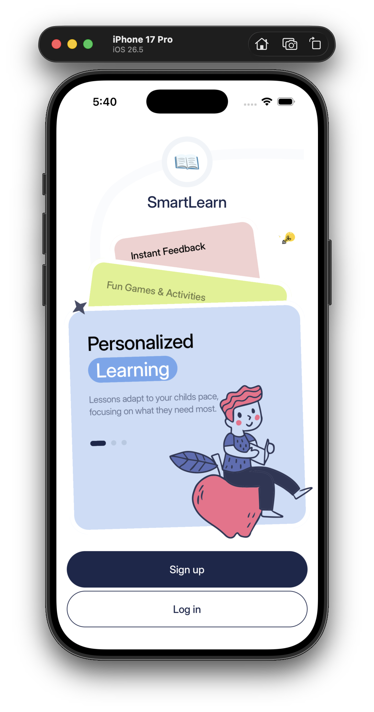
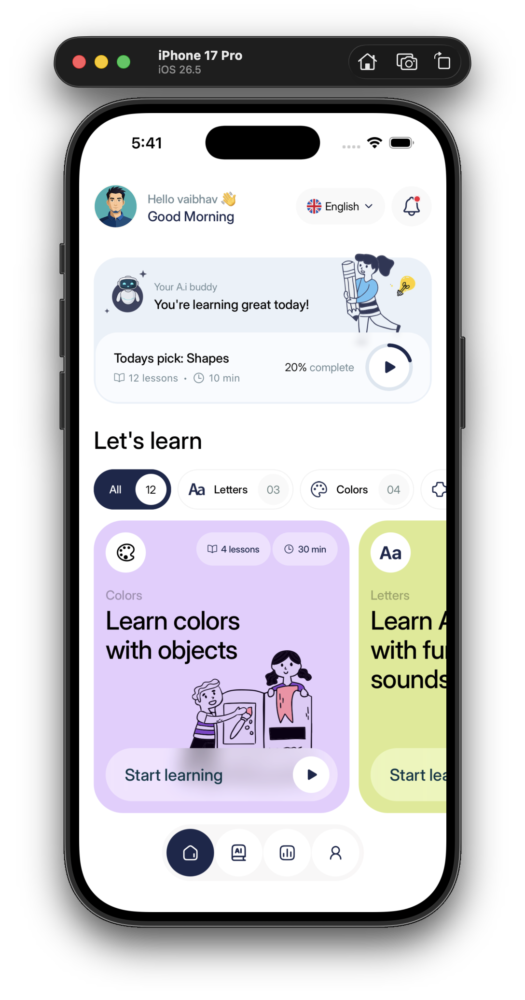
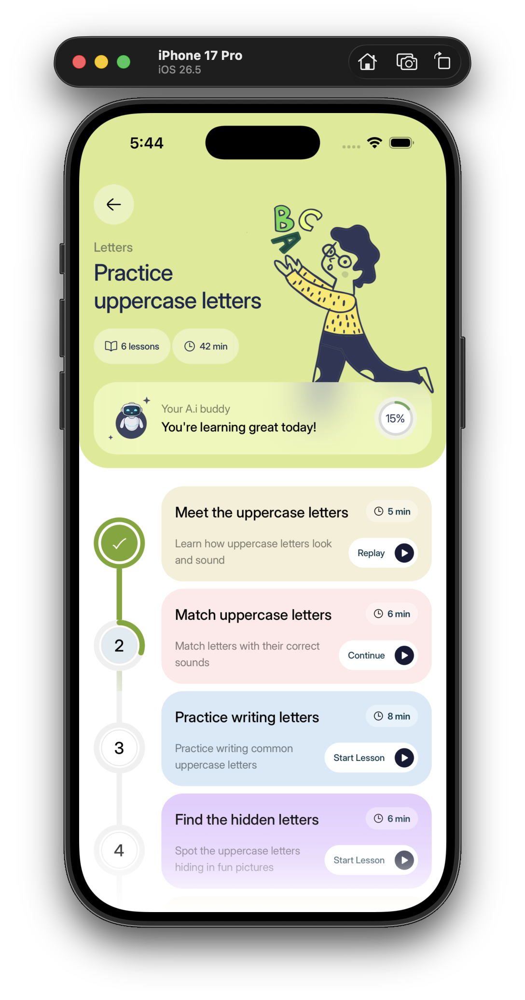
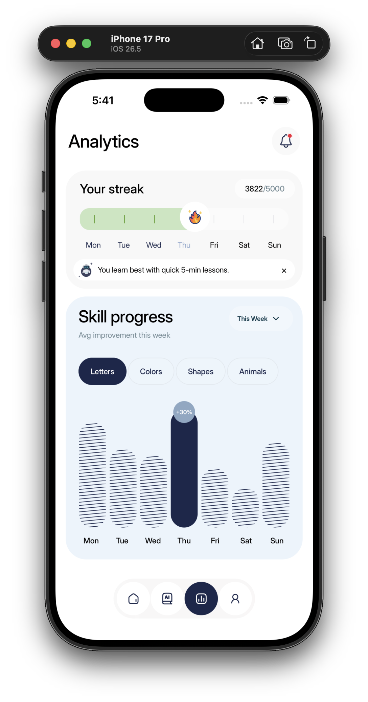
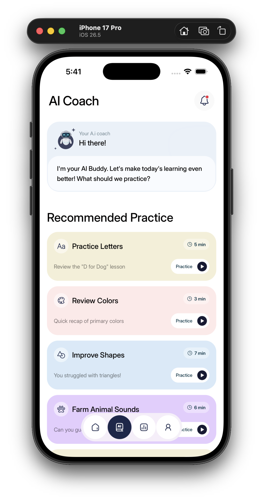
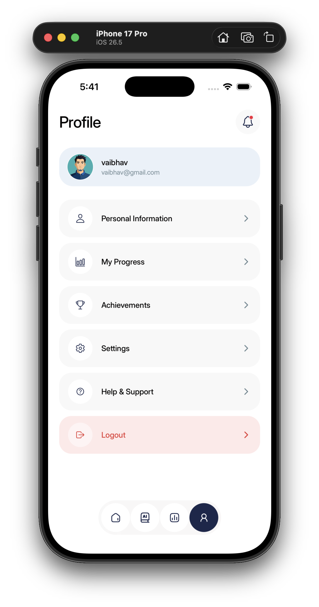

# SmartLearn

I built SmartLearn React Native application to practice building a clean and maintainable mobile app architecture.

## App Walkthrough & Screenshots

Here is a quick look at the app and its main flows:

**App Walkthrough video:**  
https://drive.google.com/file/d/1RS-RKAoxLdV18-VIn1NiolGDAXrBcB3w/view?usp=sharing

Below are the core screens implemented based on the provided design specifications:

<p align="center">
  
  
  
</p>

<p align="center">
  
  
  
</p>

## Project Structure

```text
smartlearn-mobile/
├── app/
│   ├── (auth)/
│   ├── (tabs)/
│   ├── learn/
│   └── _layout.tsx
├── assets/
├── components/
├── data/
├── hooks/
├── screens/
│   ├── ai/
│   ├── analytics/
│   ├── auth/
│   ├── home/
│   ├── learn/
│   └── profile/
├── theme/
├── styles/
├── types/
├── utils/
├── docs/
├── app.json
├── package.json
└── README.md
```

## How to Run the Project Locally

**Repository:** https://github.com/vaibhavmali-git/smartlearn-mobile

1. Make sure you have Node.js installed, along with either the iOS Simulator or Android Emulator.

2. Clone the repository:

   ```bash
   git clone https://github.com/vaibhavmali-git/smartlearn-mobile.git
   cd smartlearn-mobile
   ```

3. Install dependencies:

   ```bash
   npm install
   ```

4. Start the Expo development server:

   ```bash
   npx expo start
   ```

5. Launch the app:
   - Press `i` for the iOS Simulator.
   - Press `a` for the Android Emulator.

## Decisions and Assumptions

While building SmartLearn, I made a few architectural choices to keep the codebase maintainable while staying close to the provided designs:

- **Additional Screens:** Some screens, including the **AI Coach, Login, Signup, and Profile** screens, were not provided in the Figma designs. I designed and implemented these screens independently, taking visual and interaction inspiration from the provided designs.

- **File-based Routing:** I used Expo Router for navigation. This keeps routing concerns separate from the UI and makes it straightforward to manage authenticated and unauthenticated routes through layout files.

- **Mock Authentication:** Since there is no backend provided for this assignment, I implemented a custom `useAuth` hook backed by `AsyncStorage`. It simulates the login and signup flow, handles basic validation, and persists the user's session when the app is restarted.

- **Custom Bottom Tab Bar:** The default navigation tab bar didn't match the floating, pill-shaped design from the provided screenshots, so I built a custom `BottomTabBar` component and integrated it with Expo Router while keeping the navigation state intact.

- **Design System & Styling:** I set up a centralized theme for colors, spacing, radii, and typography. Components follow a consistent structure with their markup and logic separated from their styles using `.styles.ts` files.

- **Typography:** I used **Inter Display** throughout the app to closely match the typography in the provided designs. The required font weights are loaded locally through Expo so typography remains consistent across platforms.
